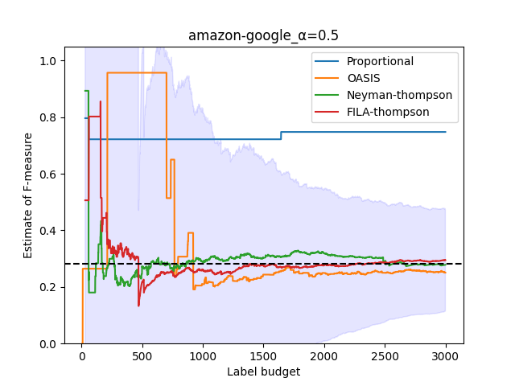
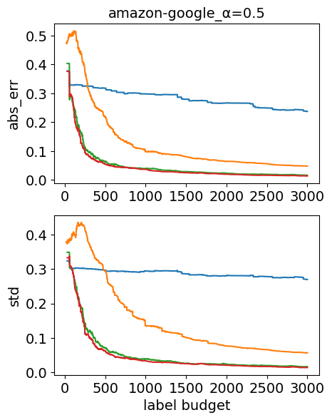

# FILA: Online Auditing of Model Accuracy in Machine Learning Based Entity Resolution Pipelines


**FILA** is a tool that audit model accuracy of ML classifiers for entity resolution pipelines. It adaptively sample from unlabeled deployment data, ask human annotators to label the sample, and estimate the F-measure of the model. It leverages the delta method and stratified sampling to derive a sample allocation that approximately minimizes the estimator's variance under finite labeling budget.

### Code Structure

Currently, the code is developed upon the open-sourced OASIS library, leveraging some of its functionalities such as stratification and initialization.  The code for FILA mainly lie in the following source files:

```
oasis/ass.py: contains code for FILA-Thompson, Neyman-Thompson and Proportional Sampling
expt.py: contains code for conducting experiments
dataset_config.json: contains the configuation for datasets used for experiments
exp_config.json: contains the configuration for adaptive samplers used for experiments
```

### Example Usage

* For a single run of the estimators:

  ```
  python expt.py --dataset_list amazon-google --exp_type single
  ```

  Example output:

  (We additionally printout confidence interval for FILA-Thompson here)

  

* Collecting statistics of the estimators:

  ```
  python expt.py --dataset_list amazon-google --exp_type stats --n_expts 100
  ```

  Example output:

  
